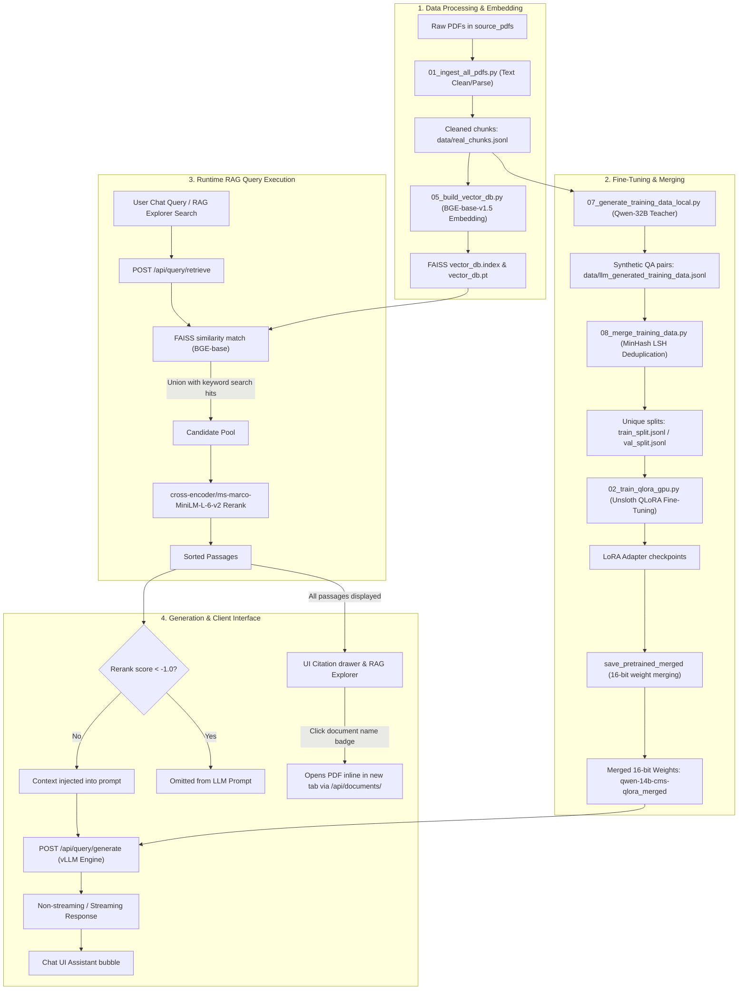

# DWP CMS Decision Support Suite: Codebase Guide & Transfer Plan

This document serves as a complete, end-to-end manual for the DWP CMS Decision Support Suite. It is structured into two main parts:
1. **Codebase Architecture & Flow**: Explaining the role of each file and how data moves from raw PDFs to the live 3-panel UI.
2. **Transfer & Deployment Plan**: Providing step-by-step instructions to pack, transfer, and host the fine-tuned 14B Qwen model inside the client's private network.

---

# Part 1: Codebase Architecture & Flow

## 📂 File Directory Map

The table below outlines the role of every key file in the codebase, detailing their input/output dependencies, core libraries, and key operations:

| File / Folder Name | Purpose | Input / Output Dependencies | Core Libraries & Tech | Key Operations & Internal Logic |
| :--- | :--- | :--- | :--- | :--- |
| [01_ingest_all_pdfs.py](file:///c:/Users/JitendraAsrani/DWP_CMG_Finetune/01_ingest_all_pdfs.py) | Document parsing & chunking | **Input**: PDF files in `source_pdfs/`<br>**Output**: `data/real_chunks.jsonl` | `PyMuPDF (fitz)`, `re`, `Counter` | Iterates over the raw policy manual PDFs. Strips recurring headers/footers dynamically by counting line repetition frequencies across pages. Groups text lines into paragraphs, constructs a unique `paragraph_id` linked to the source page, and writes clean json lines. |
| [01b_ingest_qa_pairs.py](file:///c:/Users/JitendraAsrani/DWP_CMG_Finetune/01b_ingest_qa_pairs.py) | Q&A pair dataset ingestion | **Input**: Case document files / policy Q&As<br>**Output**: Structured JSON list | `transformers`, `PyMuPDF`, `ctypes` | Parses policy Q&A documentation, extracts instruction-response training pairs matching specific policy chapter prefixes (e.g. 17xxx to 95xxx). Utilizes Windows API priorities to prevent throttling when running background CPU extractions. |
| [02_train_qlora_gpu.py](file:///c:/Users/JitendraAsrani/DWP_CMG_Finetune/02_train_qlora_gpu.py) | GPU fine-tuning execution | **Input**: `data/train_split.jsonl`, `data/val_split.jsonl`, `data/real_chunks.jsonl`<br>**Output**: LoRA checkpoints, merged 16-bit model weights | `unsloth`, `trl (SFTTrainer)`, `transformers`, `torch` | Fast GPU training via Unsloth. Loads Qwen 14B in 4-bit, targets all attention & MLP projections with rank $r=32$ and alpha $\alpha=64$. Prepares instructions by mapping paragraph IDs to context paragraphs (context baking). Merges LoRA adapters back into base weights at 16-bit precision and saves the standalone model directory. |
| [02_train_lora_windows_cpu.py](file:///c:/Users/JitendraAsrani/DWP_CMG_Finetune/02_train_lora_windows_cpu.py) | Local CPU training validation | **Input**: Training splits<br>**Output**: Local PEFT checkpoints | `peft`, `transformers`, `torch` | A CPU fallback script running on standard PyTorch + Hugging Face PEFT to validate the training parameters locally without GPU resources. |
| [05_build_vector_db.py](file:///c:/Users/JitendraAsrani/DWP_CMG_Finetune/05_build_vector_db.py) | Vector database indexing | **Input**: `data/real_chunks.jsonl`<br>**Output**: `vector_db.index` (FAISS), `vector_db.pt` (metadata) | `faiss-cpu`, `transformers (BGE-base-v1.5)`, `torch` | Loads text chunks, sub-chunks paragraphs exceeding 500 tokens using a sliding window (100 token overlap). Runs BGE-base-en-v1.5, extracts mean-pooled outputs, normalizes them, builds a FAISS Flat Inner-Product search index, and exports index weights and mappings. |
| [07_generate_training_data_local.py](file:///c:/Users/JitendraAsrani/DWP_CMG_Finetune/07_generate_training_data_local.py) | Synthetic training data gen | **Input**: `data/real_chunks.jsonl`<br>**Output**: `data/llm_generated_training_data.jsonl` | `transformers (Qwen2.5-32B)`, `torch`, `unsloth` | Loads the **Qwen2.5-32B-Instruct** teacher model in 4-bit via Unsloth. Runs a dual-pass generation (generating scenarios/questions + validation checks for alignment) for every policy chunk. Note: This high-compute process requires $\approx 19.5$ GB VRAM and takes **$\approx 34$ hours** to run on a single A10G GPU. |
| [08_merge_training_data.py](file:///c:/Users/JitendraAsrani/DWP_CMG_Finetune/08_merge_training_data.py) | Deduplication & splitting | **Input**: `data/llm_generated_training_data.jsonl`<br>**Output**: `data/train_split.jsonl`, `data/val_split.jsonl`, `data/evaluation_set.jsonl` | `datasketch (MinHash + LSH)` | Loads generated QA datasets, applies MinHash LSH fuzzy matching (Jaccard similarity threshold=0.85) to remove duplicates, shuffles records, performs a 90% train / 10% validation split, and extracts a 35-item golden evaluation dataset. |
| [09_evaluate_model.py](file:///c:/Users/JitendraAsrani/DWP_CMG_Finetune/09_evaluate_model.py) | Model evaluation suite | **Input**: `data/evaluation_set.jsonl`, Merged Model weights<br>**Output**: Evaluation report logs | `rouge-score`, `bert-score`, `vllm` | Automatically queries the fine-tuned model against the validation set. Computes token generation speed, ROUGE-L exact n-gram matching, and BERTScore semantic F1 scores. |
| [app.py](file:///c:/Users/JitendraAsrani/DWP_CMG_Finetune/app.py) | Production web API server | **Input**: `vector_db.index`, `vector_db.pt`, Merged Model weights<br>**Output**: Web HTTP endpoints, `/api/documents/` file streams | `Flask`, `vllm`, `faiss`, `sentence-transformers` | Handles REST requests. Retrieves relevant passages using a union of FAISS cosine similarity and BM25 keyword matching, reranked by a Cross-Encoder. Filters out contexts with scores $< -1.0$ from prompt generation context, and runs fast quantized vLLM inference. Serves original PDF guides inline via safe directories streaming. |
| [templates/index.html](file:///c:/Users/JitendraAsrani/DWP_CMG_Finetune/templates/index.html) | Main HTML interface | **Input**: None (assets served by Flask)<br>**Output**: Client browser layout | HTML5, FontAwesome | Defines the 3-panel layout (Interactive chatbot, training metrics KPI convergence dashboard, RAG document explorer). |
| [static/script.js](file:///c:/Users/JitendraAsrani/DWP_CMG_Finetune/static/script.js) | Frontend controller | **Input**: User interactions, Server API calls<br>**Output**: Dynamic DOM updates | Vanilla Javascript (ES6) | Orchestrates DOM rendering, routes queries, displays citations with excluded state styling, auto-scrolls chat window, and handles interactive PDF rendering. |
| [static/style.css](file:///c:/Users/JitendraAsrani/DWP_CMG_Finetune/static/style.css) | UI stylesheet | **Input**: None<br>**Output**: CSS styling layer | Vanilla CSS | Implements dark theme color palette, dashboard chart sizing, custom animations, and layout cards styling (opacity 0.6 and dashed red borders for excluded passages). |
| `source_pdfs/` | PDF Storage Directory | **Input**: Original PDF files from DWP policy library | Storage Folder | Holds the source PDF policy manuals served directly to the user's browser. |
| `data/` | Data cache directory | **Input**: Generated data, logs, stats | Cache Folder | Cache directory for pipeline training logs, evaluation reports, and model metrics datasets. |
| `trained_models/` | Output weights directory | **Input**: LoRA weights merged with base model | Weights Folder | Houses the PEFT checkpoints and the fully merged 16-bit model weights folder (`qwen-14b-cms-qlora_merged`). |

---

## 🔄 End-to-End System Flow



---

# Part 2: Model Transfer & Private Deployment Plan

To move the system and the fully-merged Qwen 14B model weights into the client's secure network and run it on their private server, follow this deployment protocol.

## 📦 Phase A: Packaging the Model & Codebase (Source Server)

The fine-tuned model weights directory holds approximately **27.5 GB** of data. You must compress the weights and bundle the codebase files for clean extraction on the target server.

### 1. Compress the Model Weights
On the source EC2 server, compress the merged model weights folder. Use `tar` with gzip compression to preserve directory structures and symlinks:
```bash
cd /home/ubuntu/dwp-cmg-finetune/trained_models
tar -cvzf qwen-14b-cms-qlora_merged.tar.gz qwen-14b-cms-qlora_merged/
```

### 2. Package the Source PDFs & Vector DB Index
Ensure you package the document files, FAISS vector index, and metadata files:
```bash
cd /home/ubuntu/dwp-cmg-finetune
tar -cvzf codebase_and_db.tar.gz app.py requirements.txt vector_db.index vector_db.pt source_pdfs/ static/ templates/
```

---

## 🚚 Phase B: Transferring Files via Private Hugging Face Repository

Since client security policies prohibit direct network copies (SCP/SFTP), external S3 bucket copies, and physical media transfer, we can use a **Private Hugging Face Hub Repository** as a secure, firewall-friendly bridge. The client network must permit HTTPS egress to `huggingface.co`.

### 1. Uploading the Model Weights (From Source Server)
Install the Hugging Face Hub CLI and upload the merged 16-bit weights to a private repository:

```bash
# Install Hugging Face Hub library
pip install huggingface_hub

# Authenticate with a Write Access Token
huggingface-cli login

# Create a private model repository
# (Replace 'your-username' with your Hugging Face username)
huggingface-cli repo create dwp-qwen-14b-tuned --private

# Clone the empty repo locally
git clone https://huggingface.co/your-username/dwp-qwen-14b-tuned
cd dwp-qwen-14b-tuned

# Copy the merged weights content into the cloned directory
cp -r /home/ubuntu/dwp-cmg-finetune/trained_models/qwen-14b-cms-qlora_merged/* .

# Push weights to the private repository (Git LFS handles large files automatically)
git add .
git commit -m "Upload fine-tuned Qwen 14B merged weights"
git push origin main
```

### 2. Transferring the Codebase
Since the codebase contains no model weights and is very lightweight (~2MB), it can be zipped and moved via standard allowed secure channels (e.g. Email/Teams if approved, or placed inside a separate private Hugging Face dataset/repo):
```bash
cd /home/ubuntu/dwp-cmg-finetune
tar -cvzf codebase_and_db.tar.gz app.py requirements.txt vector_db.index vector_db.pt source_pdfs/ static/ templates/
```

### 3. Downloading the Model Weights (On Target Server)
On the client's target server:
```bash
# Authenticate using a Hugging Face READ token
huggingface-cli login

# Download the model weights directly to the trained_models folder
mkdir -p /home/ubuntu/dwp-cmg-finetune/trained_models
huggingface-cli download your-username/dwp-qwen-14b-tuned --local-dir /home/ubuntu/dwp-cmg-finetune/trained_models/qwen-14b-cms-qlora_merged
```

---

## 🖥️ Phase C: AWS Target Server Hosting Setup

### 1. AWS Hardware & Instance Recommendations

Since the client hosts exclusively on AWS, use the following Amazon EC2 instance configurations optimized for vLLM model hosting:

#### **A. Development & Testing (DEV) Instances**
Designed for developer sandbox validation, manual model testing, and RAG evaluation.
* **`g5.xlarge` or `g5.2xlarge` Instances**:
  * **GPU**: 1x NVIDIA A10G (24GB VRAM)
  * **System RAM**: 16 GB (`g5.xlarge`) or 32 GB (`g5.2xlarge`)
  * **AWS Hourly Rate**: $\approx$ \$1.00 - \$1.21 / hour
  * **Why**: The most cost-efficient option for single-user validation. Successfully runs the Qwen 14B model under 4-bit bitsandbytes quantization (requires $\approx 19.4$ GB VRAM).

#### **B. Production (PROD) Instances**
Designed for high-throughput, multi-user concurrency, low latency, and native 16-bit precision hosting.
* **`g5.12xlarge` Instances (Recommended)**:
  * **GPU**: 4x NVIDIA A10G (96GB total VRAM)
  * **System RAM**: 192 GB
  * **AWS Hourly Rate**: $\approx$ \$5.67 / hour
  * **Why**: Highly cost-effective datacenter choice. It allows you to configure vLLM to run in **Tensor Parallelism** mode across 2 or 4 GPUs (e.g. `--tensor-parallel-size 2` or `4`). Sharding the model provides enough VRAM to host the Qwen 14B model in its **native, unquantized 16-bit (bf16/fp16) format** (takes $\approx 28$ GB VRAM) with a large remaining VRAM buffer for the Key-Value (KV) cache to handle multiple concurrent user chats.
* **`p4d.24xlarge` / `p4de.24xlarge` Instances (High Concurrency)**:
  * **GPU**: 8x NVIDIA A100 (320GB or 640GB total VRAM)
  * **Why**: High-concurrency enterprise tier. A single A100 GPU (40GB/80GB) is capable of hosting the 16-bit unquantized model with continuous batching and PagedAttention, delivering high throughput.
* **`p5.48xlarge` Instances (Next-Gen High Performance)**:
  * **GPU**: 8x NVIDIA H100 (640GB total VRAM)
  * **Why**: The lowest generation latency, suitable if the client requires large-scale corporate deployments.

---

### 2. Software Installation (Using AWS Deep Learning AMI)

To minimize deployment time and eliminate manual graphics driver, CUDA developer package, and PyTorch compiler installations, use a pre-existing AWS AMI:
* **Recommended AMI**: **Deep Learning AMI GPU PyTorch 2.x (Ubuntu 22.04)**

#### **Step 1: Launch the EC2 Instance**
Configure the EC2 instance using the DLAMI with a minimum of **80 GB SSD (gp3)** storage.

#### **Step 2: Access and Extract files on Target**
SSH into the target instance, extract the codebase files, and configure the project directory:
```bash
# Extract the Codebase & Database files
mkdir -p /home/ubuntu/dwp-cmg-finetune
tar -xvzf codebase_and_db.tar.gz -C /home/ubuntu/dwp-cmg-finetune
```

#### **Step 3: Activate Pre-Installed PyTorch Conda Environment**
The AWS DLAMI comes pre-installed with conda environments with matching CUDA toolkit drivers. Locate and activate the PyTorch environment:
```bash
# List available environments
conda env list

# Activate the GPU-optimized PyTorch environment (usually named pytorch)
conda activate pytorch
```

#### **Step 4: Install Missing Server Libraries**
Since CUDA and PyTorch are pre-installed in the DLAMI environment, you only need to install missing runtime libraries:
```bash
cd /home/ubuntu/dwp-cmg-finetune

# Install additional packages inside the active Conda environment
pip install vllm==0.23.0 flask faiss-cpu sentence-transformers
```

---

## 🚀 Phase D: Execution & Production Launch

### 1. Set Environment Configurations
Set the necessary paths and disable the JIT compiler to bypass local developer toolkit compilation requests:
```bash
export PATH="/usr/local/cuda/bin:$PATH"
export VLLM_USE_FLASHINFER_SAMPLER="0" # Disables FlashInfer JIT compiler
```

### 2. Launch the API Web Server
Run the Flask server inside the virtual environment. It will bind on all local interfaces (`0.0.0.0`) so it can be exposed behind Nginx. Use `nohup` to run it persistently:
```bash
mkdir -p data
nohup python3 app.py > data/flask_server.log 2>&1 &
```

### 3. Monitor Initialization Logs
Tail the logs to track database loading and vLLM compilation. It will take ~3-4 minutes to load the weights into GPU memory and run the initial graph profiling:
```bash
tail -f data/flask_server.log
```
Look for these validation log statements:
```text
vLLM engine loaded successfully!
Models/DB initialization completed.
Web server running on http://0.0.0.0:5000 (DEMO_MODE=False)
```

---

## 🛠️ Phase E: Target Network Verification Checklist

Confirm everything is functioning correctly by running these diagnostic checks on the client's network:

1. **Verify GPU Memory consumption**:
   ```bash
   nvidia-smi
   ```
   *Expected result*: You should see `VLLM::EngineCore` holding $\approx 19.4\text{ GB}$ of VRAM.

2. **Test API Authentication and Response Generation**:
   Use Python's built-in `urllib` module (to avoid shell escaping problems) to test model response:
   ```bash
   python3 -c "import urllib.request, json; req = urllib.request.Request('http://localhost:5000/api/query/generate', data=json.dumps({'query': 'unearned income variation rules', 'model': 'qwen_14b_tuned', 'use_rag': False}).encode('utf-8'), headers={'X-API-Key': 'dwp-cmg-sec-key-7d9a1f8c', 'Content-Type': 'application/json'}); print(urllib.request.urlopen(req).read().decode('utf-8'))"
   ```
   *Expected result*: A valid JSON response containing `{"model": "qwen_14b_tuned", "response": "..."}`.

3. **Verify Interactive PDF serving**:
   Run a `curl` call to download one of the documents:
   ```bash
   curl -I "http://localhost:5000/api/documents/2012-System-Overview.pdf?api_key=dwp-cmg-sec-key-7d9a1f8c"
   ```
   *Expected result*: HTTP response status `200 OK`, `Content-Type: application/pdf`, and `Content-Disposition: inline`.

---

## 🔒 Phase F: Nginx Reverse Proxy with SSL Config

To host the application behind Nginx with SSL, configure Nginx to listen on port `443` and forward requests to the Flask server (listening on port `5000` on the loopback address `127.0.0.1`).

### 1. Configure Flask to Listen on Localhost Only
First, modify the launch configuration in `/home/ubuntu/dwp-cmg-finetune/app.py` or the execution shell script to run on `127.0.0.1` instead of `0.0.0.0` for local proxy loopback security.

### 2. Nginx Server Configuration Block
Create a new site configuration file (e.g., `/etc/nginx/sites-available/dwp-decision-support`):

```nginx
# HTTP - Redirect all traffic to HTTPS
server {
    listen 80;
    listen [::]:80;
    server_name dwp-cms-suite.client.internal; # Replace with target domain name

    return 301 https://$host$request_uri;
}

# HTTPS - Secure Proxy Server
server {
    listen 443 ssl http2;
    listen [::]:443 ssl http2;
    server_name dwp-cms-suite.client.internal;

    # SSL Certificate Paths
    ssl_certificate /etc/ssl/certs/dwp_cms_suite.crt;
    ssl_certificate_key /etc/ssl/private/dwp_cms_suite.key;

    # Strong SSL Protocol Configuration
    ssl_protocols TLSv1.2 TLSv1.3;
    ssl_prefer_server_ciphers on;
    ssl_ciphers 'ECDHE-ECDSA-AES128-GCM-SHA256:ECDHE-RSA-AES128-GCM-SHA256:ECDHE-ECDSA-AES256-GCM-SHA256:ECDHE-RSA-AES256-GCM-SHA256:DHE-RSA-AES128-GCM-SHA256:DHE-RSA-AES256-GCM-SHA256';

    # Log files
    access_log /var/log/nginx/dwp_suite_access.log;
    error_log /var/log/nginx/dwp_suite_error.log;

    # Static file serving directly via Nginx (Optimized for speed)
    location /static/ {
        alias /home/ubuntu/dwp-cmg-finetune/static/;
        expires 30d;
        add_header Cache-Control "public, no-transform";
    }

    # Proxy root location to Flask Web App
    location / {
        proxy_pass http://127.0.0.1:5000;
        
        # Standard proxy headers
        proxy_set_header Host $host;
        proxy_set_header X-Real-IP $remote_addr;
        proxy_set_header X-Forwarded-For $proxy_add_x_forwarded_for;
        proxy_set_header X-Forwarded-Proto $scheme;

        # Disable buffering to allow real-time vLLM response streaming
        proxy_buffering off;
        proxy_read_timeout 300;
        proxy_connect_timeout 300;
        proxy_send_timeout 300;
        
        # Keepalive settings
        proxy_http_version 1.1;
        proxy_set_header Connection "";
    }
}
```

### 3. Deploy and Reload Nginx
Enable the site configuration and restart Nginx:
```bash
# Link to active sites
sudo ln -s /etc/nginx/sites-available/dwp-decision-support /etc/nginx/sites-enabled/

# Test Nginx syntax configuration
sudo nginx -t

# Restart Nginx
sudo systemctl restart nginx
```

---

## 🔄 Phase G: Alternative Transfer & Merge (LoRA Adapter Only)

If you prefer to minimize upload bandwidth from the source server (or if the client has already cached the base `Qwen/Qwen2.5-14B-Instruct` model weights locally), you can choose to transfer **only the LoRA adapter weights ($\approx 200$ MB)** and perform the model merging step directly on the target server using standard, compilation-free Hugging Face library calls.

### 1. Upload the LoRA Adapter (From Source Server)
Upload the adapter weights directory `/home/ubuntu/dwp-cmg-finetune/trained_models/qwen-14b-cms-qlora` to a private Hugging Face repository:
```bash
# Authenticate
huggingface-cli login

# Create a private adapter repository
# (Replace 'your-username' with your Hugging Face username)
huggingface-cli repo create dwp-qwen-14b-adapter --private

# Clone locally
git clone https://huggingface.co/your-username/dwp-qwen-14b-adapter
cd dwp-qwen-14b-adapter

# Copy adapter files (metadata and adapter_model.safetensors)
cp -r /home/ubuntu/dwp-cmg-finetune/trained_models/qwen-14b-cms-qlora/* .

# Push to Hugging Face
git add .
git commit -m "Upload Qwen 14B LoRA adapter weights"
git push origin main
```

### 2. Download the Adapter (On Target Server)
On the target server, activate the DLAMI PyTorch environment and download the adapter weights:
```bash
# Authenticate
huggingface-cli login

# Download private adapter
mkdir -p /home/ubuntu/dwp-cmg-finetune/trained_models/qwen-14b-cms-qlora
huggingface-cli download your-username/dwp-qwen-14b-adapter --local-dir /home/ubuntu/dwp-cmg-finetune/trained_models/qwen-14b-cms-qlora
```

### 3. Create the Merging Script
To perform the merge without needing to compile `unsloth`, you can use the standard Hugging Face `peft` package. Create a script named `/home/ubuntu/dwp-cmg-finetune/merge_adapters.py`:

```python
import os
import torch
from transformers import AutoModelForCausalLM, AutoTokenizer
from peft import PeftModel

base_model_path = "Qwen/Qwen2.5-14B-Instruct"  # Downloaded from HF or pointed to a local cache folder
adapter_path = "./trained_models/qwen-14b-cms-qlora"
output_path = "./trained_models/qwen-14b-cms-qlora_merged"

print("Loading base model in 16-bit precision...")
base_model = AutoModelForCausalLM.from_pretrained(
    base_model_path,
    torch_dtype=torch.float16,
    device_map="auto"
)
tokenizer = AutoTokenizer.from_pretrained(base_model_path)

print("Loading PEFT adapter and merging parameters...")
model = PeftModel.from_pretrained(base_model, adapter_path)
merged_model = model.merge_and_unload()

print(f"Saving merged 16-bit model weights to {output_path}...")
merged_model.save_pretrained(output_path)
tokenizer.save_pretrained(output_path)
print("Model merge complete!")
```

### 4. Execute the Merge on Target Server
Install the standard `peft` dependency (this is a lightweight pure-python package and does not require complex CUDA compilation) and run the merging script:
```bash
# Install PEFT in active conda environment
pip install peft

# Run the merge script (requires GPU to map layer weights)
python3 merge_adapters.py
```
After execution completes, the merged weights will be outputted to `/home/ubuntu/dwp-cmg-finetune/trained_models/qwen-14b-cms-qlora_merged`, ready to be loaded by `vllm` as described in **Phase D**.

