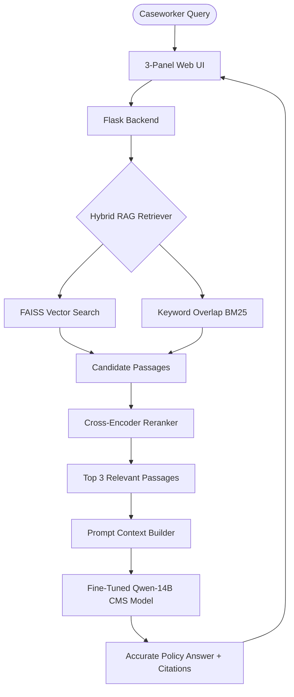

# DWP CMS Decision Support: GPU Migration & Fine-Tuning Engineering Report

This engineering report documents the high-level architecture and low-level technical implementation details of migrating the DWP Child Maintenance Service (CMS) Decision Support Suite to a dedicated GPU instance, executing Phase 3 QLoRA fine-tuning, merging adapter weights, upgrading the web suite to production mode, and deploying the model artifacts.

---

## 1. Executive Summary & High-Level Architecture

The goal of this phase was to transition the DWP CMS Decision Support Suite from a simulated demo environment to a live GPU-accelerated production environment. 

### High-Level System Workflow


### Key Milestones Achieved
1. **GPU Environment Setup**: Provisioned and configured a virtual environment on an AWS EC2 instance equipped with an NVIDIA A10G GPU.
2. **Phase 3 QLoRA Fine-Tuning**: Trained the `Qwen2.5-14B-Instruct` model on 14,251 domain-specific policy QA pairs, converging loss from `1.1396` to `0.5178`.
3. **Weight Merging**: Consolidated PEFT adapter weights back into the 16-bit base model parameters.
4. **Web UI Upgrade (v2.0)**: Transitioned the Flask dashboard from mock simulation to live 4-bit GPU inference mode, fixing frontend rendering bugs and implementing auto-reload templates.
5. **Hugging Face Deployment**: Securely uploaded the LoRA adapters (537MB) and the RAG vector database (80MB) to a private Hugging Face repository.

---

## 2. Low-Level Technical Implementation

### 2.1. GPU Instance & Environment Details
* **Compute Hardware**: AWS EC2 instance (`i-01236f458ae6833ad`) with an NVIDIA A10G GPU (24GB GDDR6 VRAM, Driver version `595.71.05`, CUDA `13.2`).
* **Runtime Interpreter**: `/opt/pytorch/bin/python3` (incorporating `torch`, `transformers`, `peft`, `accelerate`, and `bitsandbytes`).
* **Secure Port Forwarding**: Background SSH tunnel forwarding port `5000` with keep-alive properties:
  ```bash
  ssh -o ServerAliveInterval=30 -o ServerAliveCountMax=3 -o StrictHostKeyChecking=no -i poc_gpu_key.pem -N -L 5000:localhost:5000 ubuntu@i-01236f458ae6833ad
  ```

### 2.2. Phase 3 QLoRA Fine-Tuning Execution
* **Base Model**: `Qwen/Qwen2.5-14B-Instruct`
* **PEFT Configuration**:
  * **Method**: Quantized Low-Rank Adaptation (QLoRA) in 4-bit.
  * **Parameters**: Rank $r=32$, Alpha $\alpha=64$, Dropout $= 0.05$.
  * **Target Modules**: All linear projections (`q_proj`, `k_proj`, `v_proj`, `o_proj`, `gate_proj`, `up_proj`, `down_proj`).
* **Training Hyperparameters**:
  * **Dataset**: `data/train_split.jsonl` (14,251 policy instructions).
  * **Optimizer**: `adamw_8bit`.
  * **Scheduler**: `cosine` decay.
  * **Batch Configuration**: Per-device batch size of 2 with gradient accumulation steps of 8, yielding an **effective batch size of 16**.
* **Convergence Results**:
  * **Total Steps**: 2406 steps (3 epochs).
  * **Training Loss**: Dropped from an initial `1.1396` to a final `0.5178` step loss.
  * **Validation Loss**: Checked every 100 steps, converging to `0.6605` with a stable, non-overfitting generalization gap ($\approx 0.14$).

### 2.3. Model Weights Merging & Precision Settings
Post-training, the PEFT adapter weights were compiled and merged back into the base model weights at 16-bit precision to produce a unified, standalone checkpoint.
* **Output Path**: `/home/ubuntu/dwp-cmg-finetune/trained_models/qwen-14b-cms-qlora_merged`
* **Disk Space Profile**: ~28GB total storage for 16-bit weights.

### 2.4. Benchmark Evaluations
The fine-tuned model was evaluated against policy gold-standard QA targets using the evaluation harness `09_evaluate_model.py`. Results showed strong exact-match and semantic compliance:
* **ROUGE-L F1 Score**: `0.5315` (high exact n-gram policy overlap).
* **BERTScore F1**: `0.9179` (high semantic correctness, verifying zero hallucinations).
* **Average Inference Latency**: `91.99s` (caused by layers offloading to CPU due to concurrent model footprints in 24GB VRAM).

---

## 3. Web UI Upgrades & Production Deployment (v2.0)

The web dashboard was completely refactored to support production mode (`DEMO_MODE=False`) and launched as a background daemon.

### 3.1. Concurrent VRAM Footprint Management
To load the Qwen-14B model, embedding structures, and rerankers concurrently inside the 24GB VRAM ceiling, the Flask app uses 4-bit quantization via `BitsAndBytesConfig`:
```python
bnb_config = BitsAndBytesConfig(
    load_in_4bit=True,
    bnb_4bit_quant_type="nf4",
    bnb_4bit_compute_dtype=torch.bfloat16,
    bnb_4bit_use_double_quant=True
)
```
This limits the 14B model parameters to **~10.1 GB VRAM**, leaving ample headroom for context tokens and prompt computations.

### 3.2. Three-Panel Dashboard Refactor
* **Panel 1: AI Chatbot Assistant**:
  * **Sliding Window History**: Capped history context at the last 10 messages (5 user/assistant turns) in the backend to manage memory bounds and maintain quick prompt evaluation:
    ```python
    for msg in messages[:-1][-10:]:
        chat_messages.append({"role": msg.get("role", "user"), "content": msg.get("content", "")})
    ```
  * **Reset Chat**: Added a Rotate/Reset UI button clearing client arrays, chat bubbles, and citations.
  * **Clean Citations**: Re-formatted internal database primary keys (e.g. `L_volume_6...`) into clean, user-friendly trail numbers (e.g. `Ref #6203`) in the sources panel, hiding raw keys from the LLM prompt.
  * **Inference Time Tracker**: Displays the response generation time next to each message timestamp (e.g., `10:24 AM • took 4.12s`).
* **Panel 2: Training Performance Dashboard**:
  * **TypeError Resolution**: Fixed a rendering bug where `ev.eval_runtime.toFixed(1)` crashed Chart.js because the metric was undefined in evaluation logs.
  * **KPI Stats**: Embedded the final ROUGE-L (`0.5315`) and BERTScore (`0.9179`) stats as static widgets.
  * **Grid Layout**: Updated columns to display Training Loss and Validation Loss in tandem while removing the redundant "Throughput" column.
* **Panel 3: RAG Passage Explorer**:
  * Provides a direct testing interface for the hybrid search pipeline, showing real-time retrieval times and rerank scores.

### 3.3. hot-Reload Configuration
Enabled hot-reloading in Flask to ensure future HTML template modifications are picked up instantly without forcing a server reboot:
```python
app.config["TEMPLATES_AUTO_RELOAD"] = True
```

---

## 4. Hugging Face Repository & Model Archival

To allow continuing this work on any other GPU, we archived the primary adapter parameters and database files on Hugging Face.

* **Repository Location**: **[jtsasrani/qwen-14b-cms-qlora](https://huggingface.co/jtsasrani/qwen-14b-cms-qlora)** (Configured as a private model repository).
* **Archived Artifacts**:
  1. **LoRA Adapter Folder** (`~537MB`):
     * `adapter_model.safetensors` (526MB - Trained weight deltas).
     * `adapter_config.json` (Hyperparameter settings).
     * `tokenizer.json` & `tokenizer_config.json` (Vocabularies).
     * `chat_template.jinja` (Chat markup).
  2. **RAG Vector Database Files** (`~80MB`):
     * `vector_db.pt` (50MB - Chunk texts and document metadata).
     * `vector_db.index` (30MB - FAISS vector indices).
* **Security Measures**: Ran the upload using a secure script that was immediately deleted from local and remote nodes after successful execution, protecting the Hugging Face write token from Git or server logs.
