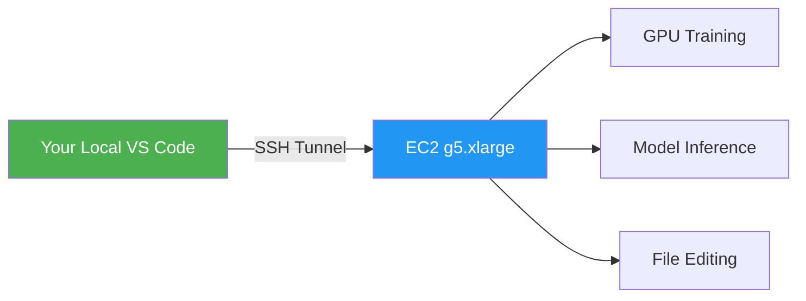

# Scaling DWP CMG Fine-Tuning POC to AWS — Strategic Roadmap

## Executive Summary

This plan transforms the current local CPU-based POC (SmolLM2-360M + RAG) into a production-grade, GPU-accelerated system on AWS. The **$2,500 credit budget is extremely generous** for this workload — a single fine-tuning run on a 7B model costs under $2 on spot instances, giving you capacity for **1,400+ training experiments**.

> [!IMPORTANT]
> The single biggest improvement will come from **upgrading the model from 360M → 7B-8B parameters**. Our evaluation showed the 360M model hallucinates heavily even with perfect RAG grounding. A 7B model with QLoRA fine-tuning will dramatically improve factual accuracy and reasoning.

---

## Current POC Architecture (Local CPU)

| Component | Current State | Limitation |
|---|---|---|
| **Base Model** | SmolLM2-360M-Instruct | Too small for complex reasoning; hallucinates facts |
| **Fine-tuning** | LoRA (r=16) on CPU | ~2 hours for 80 samples on CPU; max_length=128 |
| **Training Data** | 80 QA pairs + 300 raw samples | Small dataset, self-generated questions (low quality) |
| **RAG Retrieval** | Hybrid BM25 + Vector (MiniLM-L6-v2) | 384-dim embeddings; adequate but upgradeable |
| **Vector DB** | 1,779 chunks from 3 DWP PDFs | Good coverage, but chunking can improve |
| **Inference** | CPU multi-threaded (~15-30s/answer) | Acceptable for POC, too slow for production |

---

## Decisions Made ✅

| Question | Decision |
|---|---|
| **AWS Region** | `eu-west-2` (London) — UK data residency for DWP government data |
| **Model Selection** | Benchmark all 3 candidates (Mistral-7B, Llama-3.1-8B, Phi-3) and pick the best performer |
| **Use Case** | Decision Maker assistant tool (internal). Future goal: expand with more publicly available data to make the system broader and smarter |
| **Training Data** | Generate training data via AI automation (LLM APIs + existing PDFs). No manual curation initially. |
| **IDE Workflow** | Continue using VS Code — connect to EC2 via Remote SSH (no workflow change) |

> [!NOTE]
> **London Region Pricing Impact**: `eu-west-2` is ~5-10% more expensive than `us-east-1`. A `g5.xlarge` spot instance costs approximately **$0.53-$0.60/hr** in London vs $0.50-$0.57 in Virginia. This still gives **~4,000+ hours** of spot compute within the $2,500 budget.

---

## Model Licensing & Commercial Use

All three candidate models **CAN be used commercially without paying licensing fees**. Here is the full comparison:

| Aspect | **Mistral-7B-Instruct-v0.3** | **Llama-3.1-8B-Instruct** | **Phi-3-small-8k-instruct** |
|---|---|---|---|
| **License** | Apache 2.0 | Llama 3.1 Community License (custom) | MIT License |
| **Commercial Use** | ✅ YES — Fully permissive | ✅ YES — With conditions | ✅ YES — Fully permissive |
| **Cost / Royalties** | None | None (below thresholds) | None |
| **Sign Agreement?** | No — Standard open-source | **Yes** — Must accept on HuggingFace (gated repo) | No — Standard open-source |
| **User Threshold** | None | 700M MAU limit (not relevant for DWP) | None |
| **Branding Required** | No | **Yes** — Must display "Built with Llama" | No |
| **Can Fine-tune?** | ✅ Yes | ✅ Yes | ✅ Yes |
| **Can Distribute?** | ✅ Yes, no restrictions | ✅ Yes, with naming rules | ✅ Yes, no restrictions |
| **Patent Grant** | ✅ Explicit | Not explicitly stated | Silent (low risk) |

> [!IMPORTANT]
> **Recommendation for DWP:** Mistral-7B (Apache 2.0) and Phi-3 (MIT) have the **lowest legal friction** — standard open-source licenses requiring no agreements or branding. Llama-3.1 is usable but its custom license warrants a brief legal review before adoption.

### UK Government / DWP-Specific Considerations

| Requirement | Status |
|---|---|
| **UK GDPR Compliance** | All three support self-hosting (data stays on your infrastructure). A DPIA is required if processing personal data. |
| **Human-in-the-Loop** | Mandatory for DWP — AI serves as decision-support only, not autonomous decision-maker. Our design complies. |
| **Data Residency** | Hosting in `eu-west-2` (London) keeps data within UK. ✅ |
| **HM Government AI Framework** | Open-source, self-hosted models align well with government guidelines against vendor lock-in and "black box" systems. |
| **Data (Use and Access) Act 2025** | New UK legislation requires explainability for automated decisions. RAG citations provide built-in traceability. |
| **DWP AI Governance** | Would need to go through DWP's AI Steering Board for production deployment. POC/experimentation is fine. |

---

## Phase 1: AWS Infrastructure Setup

### Goal
Set up a GPU-equipped development environment on AWS that you can connect to from your current VS Code IDE.

### 1.1 Launch EC2 Instance

#### Recommended Instance: `g5.xlarge` in `eu-west-2` (London)
| Spec | Value |
|---|---|
| GPU | 1× NVIDIA A10G |
| VRAM | 24 GB GDDR6 |
| vCPU | 4 |
| RAM | 16 GB |
| Region | `eu-west-2` (London) |
| On-Demand | ~$1.10/hr |
| **Spot Price** | **~$0.53-$0.60/hr** (50-60% savings) |

#### Why g5.xlarge?
- 24 GB VRAM is **more than enough** for QLoRA on 7B models (needs only 8-12 GB)
- Leaves headroom for larger batch sizes and longer context windows
- Best price/performance ratio for fine-tuning workloads
- Spot instances bring cost to **~$0.50/hr** — incredibly affordable

#### Setup Steps
```
1. Log into AWS Console → EC2 → Launch Instance
2. Select AMI: "Deep Learning AMI GPU PyTorch 2.x (Ubuntu 22.04)"
   - Pre-installed: PyTorch, CUDA, cuDNN, Python 3.10+
3. Instance type: g5.xlarge
4. Enable "Request Spot Instances" (set max price to $0.75/hr for safety)
5. Storage: 100 GB gp3 SSD (for model weights + training data)
   Region: eu-west-2 (London)
6. Security Group: Allow SSH (port 22) from your IP only
7. Key pair: Create or use existing .pem file
8. Launch and note the Public IP
```

### 1.2 Connect VS Code via Remote SSH

```
1. Install "Remote - SSH" extension in VS Code (if not already installed)
2. Press Ctrl+Shift+P → "Remote-SSH: Connect to Host"
3. Enter: ubuntu@<your-ec2-public-ip>
4. Configure SSH key path in VS Code settings
5. Open your project folder on the remote instance
```

> [!TIP]
> This gives you the **exact same development experience** you have now — same file explorer, same terminal, same extensions — but running on a GPU machine. No workflow change required.

### 1.3 S3 Bucket for Persistent Storage

```
1. Create S3 bucket: "dwp-cmg-finetune-<your-id>"
2. Upload: source_pdfs/, training data, vector_db.pt
3. Cost: ~$1.15/month for 50 GB (negligible)
4. Purpose: Persist data between spot instance interruptions
```

#### [NEW] `scripts/sync_to_s3.sh`
Simple script to sync project data to/from S3 for persistence across spot instance restarts.

#### [NEW] `scripts/setup_ec2.sh`
One-time EC2 setup script: install dependencies, download model weights, configure environment.

---

## Phase 2: Model Upgrade (360M → 7B)

### Goal
Replace SmolLM2-360M with a 7B-class model that can actually reason over policy contexts.

### 2.1 Model Candidates — Benchmark All Three

| Model | Parameters | Context | License | QLoRA VRAM | Strengths |
|---|---|---|---|---|---|
| **Mistral-7B-Instruct-v0.3** | 7.2B | 32K | Apache 2.0 ✅ | ~10 GB | Best instruction-following, efficient, lowest legal friction |
| **Llama-3.1-8B-Instruct** | 8.0B | 128K | Custom (needs review) | ~11 GB | Strongest reasoning, huge context window |
| **Phi-3-small-8k-instruct** | 7.4B | 8K | MIT ✅ | ~10 GB | Very efficient, strong benchmarks, simple license |

#### Benchmarking Plan
We will fine-tune all three on the same training data and evaluate on the same test questions. The benchmark will compare:
- **Answer quality** (factual accuracy, hallucination rate)
- **RAG grounding** (how faithfully it uses retrieved context)
- **Inference speed** (tokens/second on A10G)
- **Training efficiency** (time-to-convergence)
- **License simplicity** (for eventual production deployment)

> [!TIP]
> At ~$1-2 per training run on spot instances, benchmarking all three costs under $10 total. This is well worth the investment to find the best model.

### 2.2 QLoRA Fine-Tuning Configuration

```python
# Key changes from current 360M LoRA config
LoraConfig(
    r=16,                    # Same rank (proven effective)
    lora_alpha=32,           # Same alpha
    target_modules=["q_proj", "k_proj", "v_proj", "o_proj",
                     "gate_proj", "up_proj", "down_proj"],
    bias="none",
    task_type=TaskType.CAUSAL_LM
)

# QLoRA additions (4-bit quantization)
BitsAndBytesConfig(
    load_in_4bit=True,
    bnb_4bit_quant_type="nf4",
    bnb_4bit_compute_dtype=torch.bfloat16,
    bnb_4bit_use_double_quant=True
)

# Training args changes
TrainingArguments(
    max_length=512,          # Up from 128 → captures full policy paragraphs
    per_device_train_batch_size=4,   # GPU allows larger batches
    gradient_accumulation_steps=4,   # Effective batch size = 16
    num_train_epochs=3,
    learning_rate=2e-4,
    warmup_ratio=0.03,
    bf16=True,               # Use bfloat16 on A10G
    gradient_checkpointing=True,
    optim="paged_adamw_32bit"  # Memory-efficient optimizer
)
```

### 2.3 Training Time & Cost Estimates

| Dataset Size | Epochs | Estimated Time | Spot Cost |
|---|---|---|---|
| 500 samples | 3 | ~1.5 hours | ~$0.75–$0.86 |
| 1,000 samples | 3 | ~3 hours | ~$1.50–$1.71 |
| 2,000 samples | 3 | ~6 hours | ~$3.00–$3.42 |

> [!TIP]
> At these prices, you can run **hundreds of experiments** trying different hyperparameters, data mixtures, and model variants — all within your $2,500 budget.

#### [MODIFY] [02_train_lora_windows_cpu.py](file:///c:/Users/JitendraAsrani/DWP_CMG_Finetune/02_train_lora_windows_cpu.py)
Refactor into `02_train_qlora_gpu.py` with:
- QLoRA 4-bit quantization via `bitsandbytes`
- GPU-aware training arguments (bf16, gradient checkpointing)
- `max_length=512` (up from 128)
- Configurable model selection (Mistral/Llama/Phi-3)
- Weights & Biases (wandb) logging for experiment tracking
- Automatic S3 checkpoint upload for spot instance resilience

---

## Phase 3: Training Data Pipeline Overhaul

### Goal
Scale from 80 self-generated Q&A pairs to 2,000+ high-quality, expert-grade training samples.

### 3.1 The Data Quality Problem

The current training data was generated by the **360M model itself** — a model that hallucinates. This creates a **garbage-in, garbage-out** loop. The fix has three parts:

### 3.2 Strategy A: LLM-Assisted Data Generation from Existing PDFs (~1,500 samples)

Use a high-quality LLM API (Claude Haiku or GPT-4o-mini) to automatically generate expert-grade Q&A pairs from the 1,779 policy paragraphs already extracted:

```
For each policy paragraph:
  1. Send paragraph to Claude/GPT-4 API
  2. Prompt: "You are a DWP Decision Maker trainer. Based on this official policy
     text, generate 1-2 realistic questions that a new Decision Maker might ask,
     along with accurate answers that cite the paragraph number."
  3. Requirements: factual accuracy, cite paragraph numbers, professional tone
  4. Store as instruction-tuning format (instruction + output)
```

**Estimated API Cost**: ~$5-15 for 1,779 paragraphs (using Claude Haiku or GPT-4o-mini)
**Fully automated**: No manual work required — script runs end-to-end.

#### [NEW] `07_generate_training_data_api.py`
Script to call Claude/GPT-4 API for high-quality training data generation with:
- Rate limiting and retry logic
- Resume capability (saves progress incrementally)
- Quality filtering (minimum length, keyword checks)
- Output format compatible with existing training pipeline

### 3.3 Strategy B: Public Data Expansion (~500-1,000 samples)

To make the system smarter and broader (beyond just the 3 DWP PDFs we have), we can ingest additional publicly available data:

| Source | Type | URL | Content |
|---|---|---|---|
| **GOV.UK Child Maintenance Pages** | Web pages | gov.uk/child-maintenance | Plain-language guides for parents |
| **DWP DMG Volumes 1, 4, 5** | PDFs | gov.uk | Additional policy chapters not yet included |
| **CMS Decision Maker Guidance** | PDFs | gov.uk | Supplementary guidance documents |
| **UK Parliament Hansard** | Web | hansard.parliament.uk | Parliamentary debates on child maintenance legislation |
| **UK Case Law (BAILII)** | Web | bailii.org | Tribunal decisions on child maintenance appeals |

**Process (fully automated):**
1. Scrape/download public documents programmatically
2. Extract and chunk text using the same paragraph-splitting pipeline
3. Generate Q&A pairs using the LLM API (same as Strategy A)
4. Add to vector database AND training data

> [!TIP]
> This is what transforms the system from a "3-PDF lookup tool" into a genuinely knowledgeable child maintenance assistant. All these sources are publicly available UK government data.

#### [NEW] `10_ingest_public_data.py`
Automated scraper/downloader for public DWP and GOV.UK data sources.

### 3.4 Strategy C: Augmentation from Existing Data (~500 samples)

Use the 300 existing `cmg_real_training_data.jsonl` samples:
- Rephrase questions using the LLM API (synonym substitution, different phrasing)
- Create multi-turn conversation formats
- Add "negative" examples (questions where the answer is "the policy manual does not address this")
- **All automated** — no manual work

### 3.5 Combined Training Dataset

| Source | Samples | Quality | Effort |
|---|---|---|---|
| LLM-generated from existing PDFs (Strategy A) | ~1,500 | High | Automated |
| Public data expansion (Strategy B) | ~500-1,000 | High | Automated |
| Augmented existing data (Strategy C) | ~500 | Medium-High | Automated |
| **Total** | **~2,500-3,000** | Mixed (with quality weighting) | **100% Automated** |

#### [NEW] `08_merge_training_data.py`
Merges all data sources, deduplicates, and creates final training JSONL with quality-tier metadata for weighted sampling during training.

---

## Phase 4: RAG Pipeline Upgrades

### Goal
Upgrade retrieval quality to complement the larger model's improved reasoning abilities.

### 4.1 Embedding Model Upgrade

| Current | Upgrade |
|---|---|
| `all-MiniLM-L6-v2` (384-dim) | `BAAI/bge-base-en-v1.5` (768-dim) or `nomic-embed-text-v1.5` (768-dim) |

**Why**: Higher-dimensional embeddings capture more semantic nuance, especially for domain-specific legal/policy language. The `bge-base` model consistently outperforms MiniLM on retrieval benchmarks.

### 4.2 Improved Chunking Strategy

```
Current:  Split by paragraph ID regex → variable-length chunks (some very long)
Upgraded: Recursive character splitter with:
  - chunk_size=500 tokens (fits well in 32K context)
  - chunk_overlap=100 tokens (preserves cross-paragraph references)
  - Metadata: paragraph ID, chapter, source PDF, chunk index
```

### 4.3 Cross-Encoder Reranking (Two-Stage Retrieval)

```
Stage 1: Retrieve top-20 candidates using hybrid BM25 + Vector (fast, broad)
Stage 2: Rerank top-20 using cross-encoder model (slow, precise)
         → Return top-3 after reranking

Recommended reranker: cross-encoder/ms-marco-MiniLM-L-6-v2
```

This two-stage approach significantly improves retrieval precision without slowing down the initial search.

### 4.4 Vector Database Upgrade

| Current | Upgrade |
|---|---|
| `torch.save()` flat file | **FAISS** index (Facebook AI Similarity Search) |

**Why**: FAISS provides sub-millisecond search on millions of vectors, supports GPU acceleration, and is the industry standard. For 1,779 chunks it's overkill, but it sets up for scaling to larger document collections.

#### [MODIFY] [05_build_vector_db.py](file:///c:/Users/JitendraAsrani/DWP_CMG_Finetune/05_build_vector_db.py)
Update to use FAISS, bge-base embeddings, and improved chunking.

#### [MODIFY] [06_run_rag_qa.py](file:///c:/Users/JitendraAsrani/DWP_CMG_Finetune/06_run_rag_qa.py)
Update to use FAISS retrieval, cross-encoder reranking, and the new 7B model.

---

## Phase 5: Evaluation Framework

### Goal
Build a rigorous, automated evaluation pipeline to compare model configurations and track improvement.

### 5.1 Evaluation Metrics

| Metric | What It Measures | How |
|---|---|---|
| **ROUGE-L** | Surface-level text overlap | Compare generated answer to reference |
| **BERTScore** | Semantic similarity | Embedding-based comparison |
| **Factual Accuracy** | Correct paragraph citations | Regex-match cited paragraph IDs |
| **Hallucination Rate** | Fabricated facts/statutes | Check for non-existent references |
| **Retrieval Precision@K** | Correct contexts retrieved | Compare to gold relevance labels |

### 5.2 Evaluation Dataset

Create a **held-out test set** of 30-50 questions with gold-standard answers and relevant paragraph IDs:
- 10 questions on maintenance calculations (Chapters 17-26)
- 10 questions on variations (Chapters 27-36)
- 10 questions on enforcement (Chapters 49-95)
- 10 edge cases / cross-chapter questions
- 10 "unanswerable" questions (tests for hallucination refusal)

#### [NEW] `data/evaluation_set.jsonl`
Gold-standard evaluation dataset with questions, reference answers, and relevant paragraph IDs.

#### [NEW] `09_evaluate_model.py`
Automated evaluation script that runs all metrics and generates a comparison report.

---

## Phase 6: Deployment & Serving

### Goal
Deploy the fine-tuned model as a usable API endpoint.

### 6.1 Recommended Architecture


### 6.2 Inference Optimization with vLLM

| Framework | Tokens/sec (A10G) | Why |
|---|---|---|
| HuggingFace `generate()` | ~30-50 | Standard, no optimization |
| **vLLM** | ~150-300 | PagedAttention, continuous batching |
| TensorRT-LLM | ~200-400 | Maximum performance, complex setup |

**Recommendation**: Use **vLLM** for 3-6× speedup over vanilla HuggingFace inference. Answer latency drops from ~10s to ~2-3s.

### 6.3 Deployment Options

| Option | Monthly Cost | Best For |
|---|---|---|
| **EC2 g5.xlarge (spot)** | ~$360-410/mo (24/7) | Development & testing |
| **EC2 g4dn.xlarge (spot)** | ~$115-150/mo (24/7) | Budget inference (T4 GPU) |
| **SageMaker Endpoint** | ~$730/mo (on-demand) | Managed, auto-scaling |
| **Lambda + S3 (serverless)** | Pay-per-request | Very low traffic |

> [!TIP]
> For initial deployment, use the same `g5.xlarge` spot instance you train on. Spin up only when needed (don't run 24/7) to conserve credits for experimentation.

#### [NEW] `app/server.py`
FastAPI server with `/query` endpoint, health checks, and structured JSON responses.

#### [NEW] `app/inference.py`
vLLM-based inference engine with QLoRA adapter loading.

---

## IDE & Development Workflow

### Can You Still Use This IDE?

**✅ YES — No workflow change required.**



**How it works:**
1. Install VS Code "Remote - SSH" extension
2. Connect to your EC2 instance via SSH
3. Everything runs on EC2, but your editor, terminal, and file explorer look exactly the same
4. You can switch between local and remote with one click

**Key advantages:**
- Same keyboard shortcuts, extensions, and workflow
- Files are on EC2 (fast GPU access) but editable locally
- Terminal commands run on EC2 automatically
- Gemini Code Assist works the same way

---

## Budget Allocation ($2,500)

### Detailed Breakdown

| Category | Allocation | Details |
|---|---|---|
| **🔬 Experimentation** | $800 | ~470 hours of g5.xlarge spot compute for training runs |
| **📊 Model Benchmarking** | $200 | Compare Mistral-7B vs Llama-3.1-8B vs Phi-3 |
| **📚 Data Generation** | $50 | Claude/GPT-4 API calls for synthetic training data |
| **🚀 Deployment & Testing** | $500 | Run inference endpoint for demo/testing (~500 spot-hours) |
| **💾 Storage (S3 + EBS)** | $50 | 12 months of S3 + attached EBS volumes |
| **📈 Monitoring** | $20 | CloudWatch, wandb (free tier) |
| **🔄 Buffer** | $880 | Reserved for unexpected costs, scaling, or extended experiments |
| **Total** | **$2,500** | |

### What This Budget Buys

| Metric | Capacity |
|---|---|
| Training runs (7B QLoRA, 3 epochs, 1K samples) | **~1,400 runs** at spot pricing |
| Hours of g5.xlarge spot compute | **~4,400 hours** |
| Different model configurations to test | **Hundreds** |
| Months of 8-hr/day development | **~18 months** |

> [!NOTE]
> This budget is **exceptionally generous** for this workload. Most fine-tuning projects spend $50-200 total on compute. You have room for extensive experimentation.

---

## Execution Timeline

| Phase | Duration | Dependencies |
|---|---|---|
| **Phase 1**: Infrastructure Setup | 1-2 days | AWS account configured |
| **Phase 2**: Model Upgrade & First Training | 2-3 days | Phase 1 complete |
| **Phase 3**: Data Pipeline Overhaul | 3-5 days | Phase 1 complete (can parallel with Phase 2) |
| **Phase 4**: RAG Upgrades | 2-3 days | Phase 2 complete |
| **Phase 5**: Evaluation Framework | 2-3 days | Phase 2 + 3 complete |
| **Phase 6**: Deployment | 2-3 days | Phase 4 + 5 complete |
| **Total** | **~2-3 weeks** | |

---

## Risk Mitigation

| Risk | Mitigation |
|---|---|
| Spot instance interruption | Checkpoint every 50 steps; auto-sync to S3 |
| Model too large for A10G | Use QLoRA (8-12 GB) — well within 24 GB limit |
| Training data quality | Multi-source approach (LLM + manual + augmented) |
| Budget overrun | 35% buffer ($880) reserved; spot pricing keeps costs minimal |
| Region-specific pricing | Verify prices before launch; use Cost Explorer alerts |

---

## Verification Plan

### Automated Tests
1. Run `09_evaluate_model.py` on the gold evaluation set after each training run
2. Compare ROUGE-L, BERTScore, and hallucination rates across model configurations
3. Benchmark inference latency (tokens/sec) on vLLM vs vanilla HuggingFace
4. Load test the FastAPI endpoint with 50 concurrent requests

### Manual Verification
1. Review 10 randomly selected answers for factual accuracy against the source PDFs
2. Test edge cases: questions spanning multiple chapters, unanswerable questions
3. Compare side-by-side: 360M (current) vs 7B fine-tuned (new) on the same 3 evaluation questions from Phase 5
4. Demonstrate the deployed endpoint to stakeholders

---

## Summary of New/Modified Files

| Action | File | Purpose |
|---|---|---|
| [NEW] | `scripts/setup_ec2.sh` | One-time EC2 environment setup |
| [NEW] | `scripts/sync_to_s3.sh` | S3 data persistence for spot resilience |
| [MODIFY] | `02_train_qlora_gpu.py` | GPU-optimized QLoRA training |
| [NEW] | `07_generate_training_data_api.py` | LLM-assisted data generation from existing PDFs |
| [NEW] | `08_merge_training_data.py` | Multi-source data merger |
| [MODIFY] | `05_build_vector_db.py` | FAISS + bge-base embeddings |
| [MODIFY] | `06_run_rag_qa.py` | Cross-encoder reranking + 7B model |
| [NEW] | `09_evaluate_model.py` | Automated evaluation pipeline |
| [NEW] | `10_ingest_public_data.py` | Scrape/download public DWP & GOV.UK data |
| [NEW] | `data/evaluation_set.jsonl` | Held-out test set |
| [NEW] | `app/server.py` | FastAPI serving endpoint |
| [NEW] | `app/inference.py` | vLLM inference engine |
