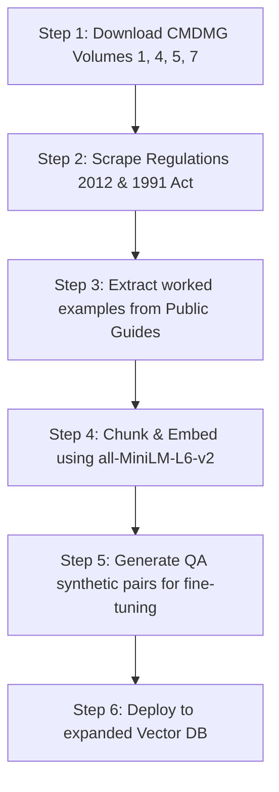

# DWP CMG Fine-Tuning Knowledge Base Expansion Plan

This document evaluates the current training data scope for the DWP CMG AI Assistant POC and provides a detailed guide on how to expand the training/RAG knowledge base using publicly available documents.

---

## 1. Expert Evaluation: Is the Current Training Base Enough?

> [!IMPORTANT]
> **No, the current baseline of 3 PDFs is insufficient for a production-grade Decision Maker assistant.**
> While the three volumes currently used (Calculations, Variations, and Enforcement) cover the core operational mathematics and actions, they miss the foundational legal, procedural, and decision-making principles that caseworkers rely on daily.

### Gaps in the Current 3-PDF Baseline
1. **Missing Foundations**: By omitting **Volume 1 (Basic Principles)**, the model lacks definitions for critical concepts like "parent with care," "qualifying child," "effective date of application," and "shared care night thresholds."
2. **No Challenge Resolution**: By omitting **Volume 5 (Review and Appeals)**, the model cannot answer questions on how to handle revisions (Mandatory Reconsideration) or supersessions—which represent a massive portion of casework queries.
3. **No Evidentiary Guidance**: By omitting **Volume 7 (Evidence and Decision Making)**, the model cannot help decision-makers understand the "balance of probabilities" standard or how to verify self-employed income when evidence is conflicting.
4. **Lack of Legal Hierarchy**: A RAG system reading only policy manuals may struggle to reference the primary legislation (Child Support Act 1991) or the secondary legislation (Maintenance Calculation Regulations 2012) when a formal decision letter requires a legal statutory reference.

---

## 2. Directory of Publicly Available CMS/CMG Documents

To build a robust knowledge base, we recommend expanding the source files into the following five categories:

| Category | Document Title | Source URL | Key Coverage | Format | Relevance |
| :--- | :--- | :--- | :--- | :--- | :--- |
| **Policy Guides** | CMDMG Vol 1: Basic Principles | [GOV.UK Link](https://www.gov.uk/government/publications/child-maintenance-decision-makers-guide) | Chapters 3-16: Duty to maintain, qualifying children, shared care rules. | PDF/Web | **Critical** |
| **Policy Guides** | CMDMG Vol 4: Information Gathering | [GOV.UK Link](https://www.gov.uk/government/publications/child-maintenance-decision-makers-guide) | Chapters 37-41: Information gathering powers, third-party requests. | PDF/Web | **Medium** |
| **Policy Guides** | CMDMG Vol 5: Review & Appeals | [GOV.UK Link](https://www.gov.uk/government/publications/child-maintenance-decision-makers-guide) | Chapters 42-48: Revisions, supersessions, appeals, and tribunal prep. | PDF/Web | **High** |
| **Policy Guides** | CMDMG Vol 7: Evidence & DM | [GOV.UK Link](https://www.gov.uk/government/publications/child-maintenance-decision-makers-guide) | Chapters 96-100: Standards of proof, evaluating conflicting evidence. | PDF/Web | **High** |
| **Legislation** | Child Support Act 1991 | [Legislation.gov.uk Link](https://www.legislation.gov.uk/ukpga/1991/48/contents) | Foundational Act: Parental duties, statutory definitions, jurisdiction. | HTML | **High** |
| **Legislation** | Child Support Maintenance Calculation Regulations 2012 | [Legislation.gov.uk Link](https://www.legislation.gov.uk/uksi/2012/2677/contents) | Secondary legislation: Exact mathematical formulas for 2012 scheme. | HTML | **Critical** |
| **Legislation** | Child Support (Collection and Enforcement) Regulations 1992 | [Legislation.gov.uk Link](https://www.legislation.gov.uk/uksi/1992/1989/contents) | Legal frameworks for DEOs, liability orders, and enforcement actions. | HTML | **High** |
| **Tribunal Precedent** | Upper Tribunal (AAC) Decisions | [GOV.UK Link](https://www.gov.uk/administrative-appeals-tribunal-decisions) | Legal precedents on appeals. Select "Social Security and Child Support". | HTML | **High** |
| **Internal Guidance** | Policy, Law and Decision Making Guidance (PLDMG) | [WhatDoTheyKnow Link](https://www.whatdotheyknow.com/) | Internal caseworker step-by-step system instructions (released via FOI). | HTML/PDF | **High** |
| **Public Guides** | "How we work out child maintenance" | [GOV.UK Link](https://www.gov.uk/government/publications/how-we-work-out-child-maintenance) | Public-facing leaflet with clean, step-by-step worked calculation examples. | PDF | **High** |
| **Complaints/Audit** | ICE Annual Reports | [GOV.UK Link](https://www.gov.uk/government/collections/ice-annual-reports) | Case studies of CMS failures, complaints, and correct resolutions. | PDF | **Medium** |

---

## 3. Recommended Knowledge Base Expansion Roadmap

### Ingestion Guidelines for the AWS Implementing Agent
1. **Chunking Strategy**: 
   - Keep DWP paragraphs (`19012`, `27005` etc.) intact as individual chunks. Do not use generic length-based chunking, as it will break the logical structure of policy rules.
   - For regulations, chunk by specific "Regulation Number" (e.g. `Regulation 34`).
2. **Synthetic Data Augmentation**:
   - Use a larger model (e.g. Claude or GPT-4o) on the newly downloaded volumes to generate ~300 high-quality Q&A training pairs (the current 80 is too small for a 7B-parameter model).
   - Inject the public worked examples directly as "few-shot" examples in the model's system prompt or fine-tuning dataset to anchor mathematical calculation abilities.
